# Classification of cancer metastases in whole slide images of lymph node with TensorFlow-Slim

Note: This project is still a **work in progress**. I have recently moved from Java to Python.

# Overview
The [CAMELYON 16](https://camelyon16.grand-challenge.org/) is a "Grand Challenge" that was created for the [2016 International Symposium on Biomedical Imaging (ISBI 2016)](https://biomedicalimaging.org/2016/?page_id=416) conference. In this challenge, the goal is to develop algorithms for detection of micro- and macro-metastases in lymph node digitized images. This subject is highly relevant; lymph node metastases occur in most cancer types (e.g. breast, prostate, colon). Lymph nodes are small glands that filter lymph, the fluid that circulates through the lymphatic system. The lymph nodes in the underarm are the first place breast cancer is likely to spread.

# Data
The data in this challenge contains a total of 400 whole-slide images (WSIs) of sentinel lymph node from two independent datasets collected in Radboud University Medical Center (Nijmegen, the Netherlands), and the University Medical Center Utrecht (Utrecht, the Netherlands). The first training dataset consists of 170 WSIs of lymph node (100 Normal and 70 containing metastases) and the second 100 WSIs (including 60 normal slides and 40 slides containing metastases).

## Brief Introduction to algorithm & project structure
There are 6 broad categories :

1. Finding Region of Interest (ROI)
2. Extract Patches from ROI
3. Train Inception V3 for classification using TF-Slim
4. Extract Patches for Inference
5. Build Tumor Probability Heatmaps
6. Post-Processing of heatmaps for tumor classification (Work in progress)


```
## Finding Region of Interest (ROI)
Why ? : The images are very large. Finding the ROI will reduce the computation time significantly.
How ? : 1. Convert the image to HSV color space, 
        2. Extract the saturation space, 
        3. Median Blur and apply Otsu Thresholding 
```
[`utils/wholeslideimages/contour_utils.py`](./utils/wholeslideimages/contour_utils.py)
<p float="left">
    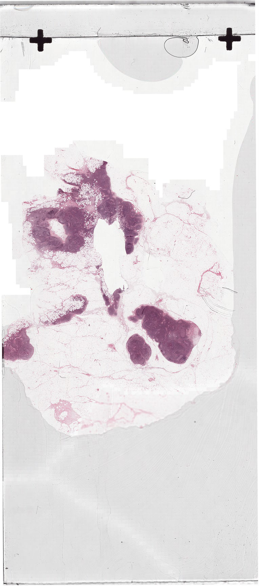
    
    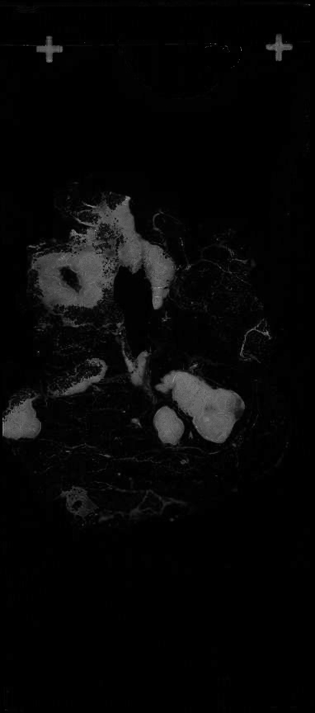
    <!-- img title = "Saturation with median blur Image" src="./images/saturation_with_median_blur_image.png" height=350/-->
    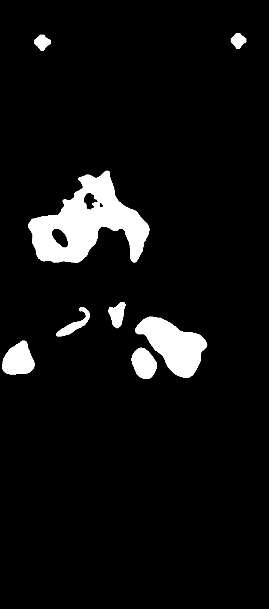
    
    <!--img title = "Base Image with Bboxs" src="./images/base_images_with_bboxs.png" height=350/-->
</p>

```
## Extract Patches from ROI
Why ? : Create training set of tumor positive and negative patches
How ? : 1. Find bounding boxes in saturation thresholded mask,
        2. Sample random points in the boxes,
        3. For each point, extract the patches from the actual images at the highest resolution
```
[`utils/wholeslideimages/generate_patches.py`](./utils/wholeslideimages/generate_patches.py)
<p float="left">
    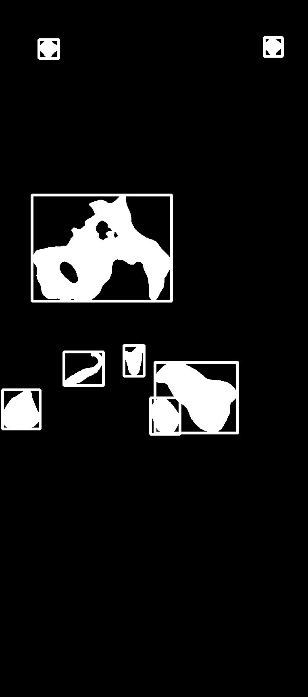
    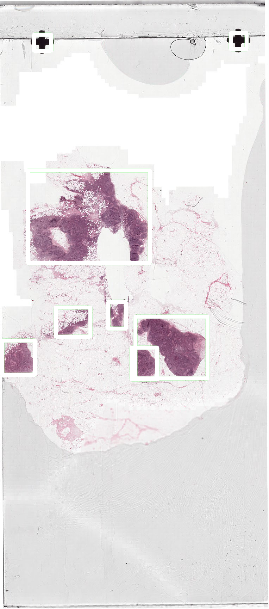
    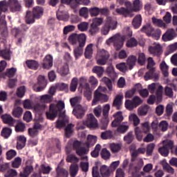
    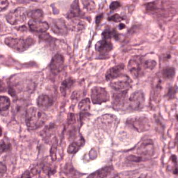
</p>


```
## Train Inception V3 for classification using TF-Slim
Why TF-Slim ? : TF-Slim is a library that makes building, training and evaluation neural networks simple
Steps : 1. Build TF records from training images (slim/datasets/convert_lymph_nodes.py),
        2. Create Dataset Provider (slim/datasets/lymph_nodes.py)
        3. Train Inception V3 by changing few parameters (slim/train_image_classifier.py)
        4. Tweak parameters (learning_rate, num_epochs_per_decay) depending on total_loss
PS : 1. TF-Slim is really a blessing. All the important code is already developed.
     2. No preprocessing/augmentation such as rotation, flipping etc done 
```
[`slim/train_image_classifier.py`](./slim/train_image_classifier.py)
<p float="left">
    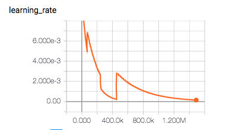
    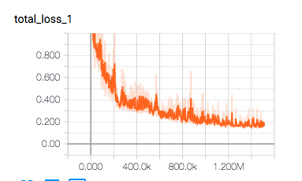
    <!--img title = "Tumor Negative Sample" src="./images/Normal_1.png" height=150/-->
    <!--img title = "Tumor Positive Sample" src="./images/Tumor_1.png" height=150/-->
</p>


```
## Extract Patches for Inference
How ? : 1. Same as finding ROI in step Part 1
        2. Generate consecutive samples, at some stride, inside bounding boxes
PS : Patches are sampled at a stride to reduce space and time complexity. 
```
[`utils/heatmaps/generate_heatmap_patches.py`](./utils/heatmaps/generate_heatmap_patches.py), [`utils/heatmaps/consecutive_patch_utils.py`](./utils/heatmaps/consecutive_patch_utils.py)

<p float="left">
    
    
    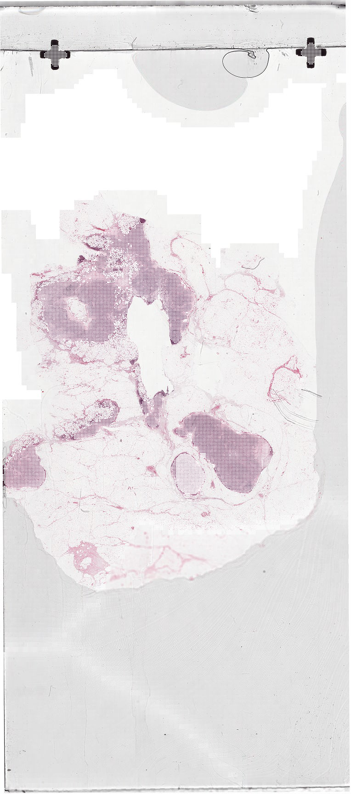
</p>

```
## Build Tumor Probability Heatmaps
Why ? : 1. Due to large size of images, we decided to do analysis on very small size patches,
        2. Hence, now we compute inference on patches using the trained model,
        3. Combining and processing the patch inferences would be the next step
How ? : 1. TF Slim is a boon. All the boilerplate code is already developed,
        2. Modified (slim/eval_image_classifier.py) as (utils/heatmaps/evaluate_raw_input_patches.py)
        3. Aggregate all the patch inferences for each wsi (utils/heatmaps/compute_heatmap_utils.py)
        4. Apply morphological operations to get a connected component (utils/heatmaps/compute_heatmap_utils.py)
PS : Below images are follows:
     1. Image with patch samples choosen for inference,
     2. Patch wise inferences
     3. Image after applying dilation and opening operation
     4. Actual tumor present in the wsi
```
[`slim/eval_image_classifier.py`](./slim/eval_image_classifier.py), [`utils/heatmaps/evaluate_raw_input_patches.py`](./utils/heatmaps/evaluate_raw_input_patches.py), [`utils/heatmaps/compute_heatmap_utils.py`](./utils/heatmaps/compute_heatmap_utils.py)
<p float="left">
    
    
    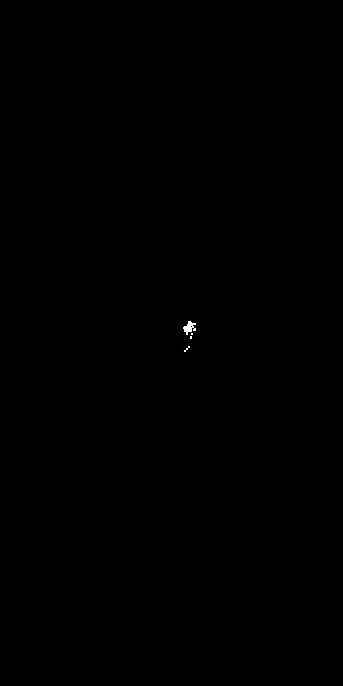
    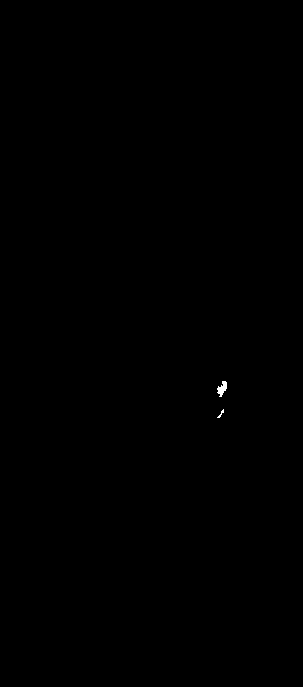
</p>
 
 
References: <br />
[1] [Deep Learning for Identifying Metastatic Breast Cancer](https://arxiv.org/abs/1606.05718) <br />
[2] [Identifying Metastases in Sentinel Lymph Nodes with Deep Convolutional Neural Networks](https://arxiv.org/abs/1608.01658) <br />
[3] https://github.com/arjunvekariyagithub/camelyon16-grand-challenge <br />
